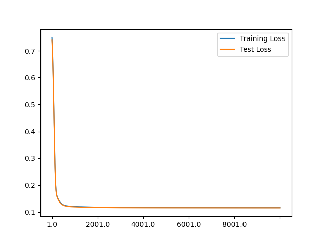

# adult-dataset-deep-learning

I used a dataset called "Adult Data Set" with the goal of creating a deep learning model to predict if the income would be exceed or not 50K a year. In particular I created a linear model to check if from the features there could be a linear correlation to the output.
Dataset -> [Download link](https://archive.ics.uci.edu/ml/datasets/adult)

In the `data/` folder there the files containing the tuples used to train and test the model, respectively in `data/adult.data` and in `data/adult.test`.

The value in the tensors given to the module for training are normalized. In this way the resulting weights can be confronted between one another without considering the different domains.

# Technology

-   Python 3.9.6
-   PyTorch 1.12.0
-   Pandas 1.3.2
-   Numpy 1.21.2

# Program Logic

The first step is the creation of the tensors from the file in which is saved the dataset. If the files `adultEncoded.npy` or `testEncoded.npy` already exist then the data is directly loaded from them. In the other case for the creation it is a necessity to adjust some data.  
The education and the income fields are mapped to integers. For example `0` in the income column represents lower or equal than 50K and `1` greater. Many features were hot encoded and for this operation was created the file "hotEncoding.py". It is important to notice that there are two fields that are very similar that are 'education' and 'education-num' that are similar, but one them can be negative and the other positive because they can create a balance between one other. 'education' is the title obtained and 'edutation-num' is the number of year studied

Then the model could be trained or retrieved from file if it already exists. The creation of a new model could be forced changing the constant `FORCE_GENERATION_NEW_MODEL`.
Statistics about the training and the results on the test set are printed during and after the training of the model

# Example of resulting model

## Results

Number of predictions: 16281  
Number of correct predictions: 13728  
Number of wrong predictions: 2553  
Percentage of correct predictions: 84.319
Percentage of correct predictions over 50K: 52.470
Percentage of correct predictions under 50K: 94.169

The difference of performance between the prediction in the 2 category could be partially explain by the fact that the majority of the entries are under 50K (76% is the percentage reported on [Kaggle](https://www.kaggle.com/datasets/wenruliu/adult-income-dataset)).

## Loss function

## Resulting weights

The weights are sorted in decreasing order. The characteristics that are more relevant for obtaining an income greater than 50K have the higher value. If the number is negative the model consider them a factor that makes the alternative '<=50K' more feasible.
For example an higher number of year of education is considered correlated to an higher income. On contrary the characteristic 'Without-pay' is correlated to a lower income.

| Feature                    | Weight   |
| -------------------------- | -------- |
| capital-gain               | 1.95942  |
| education-num              | 1.37011  |
| capital-loss               | 1.00405  |
| hours-per-week             | 0.69695  |
| age                        | 0.60873  |
| Wife                       | 0.44241  |
| Married-AF-spouse          | 0.37307  |
| Cambodia                   | 0.33143  |
| Exec-managerial            | 0.29449  |
| Federal-gov                | 0.26597  |
| fnlwgt                     | 0.26331  |
| Married-civ-spouse         | 0.24655  |
| Self-emp-inc               | 0.24464  |
| Prof-specialty             | 0.20031  |
| Male                       | 0.18396  |
| Husband                    | 0.17296  |
| Italy                      | 0.17236  |
| France                     | 0.16179  |
| Tech-support               | 0.13048  |
| Protective-serv            | 0.11760  |
| Japan                      | 0.11478  |
| Guatemala                  | 0.11064  |
| Private                    | 0.09596  |
| Yugoslavia                 | 0.09524  |
| Never-worked               | 0.07362  |
| Unknown marital-status     | 0.07243  |
| Ireland                    | 0.06378  |
| Germany                    | 0.06300  |
| Philippines                | 0.06169  |
| Sales                      | 0.06126  |
| England                    | 0.05651  |
| El-Salvador                | 0.05209  |
| Canada                     | 0.03744  |
| Female                     | 0.03669  |
| Unknown occupation         | 0.03640  |
| Married-spouse-absent      | 0.03453  |
| White                      | 0.03272  |
| Local-gov                  | 0.03248  |
| Priv-house-serv            | 0.01832  |
| Asian-Pac-Islander         | 0.01212  |
| State-gov                  | 0.00858  |
| Unknown relationship       | 0.00816  |
| Iran                       | -0.00010 |
| Widowed                    | -0.00099 |
| Black                      | -0.00733 |
| Cuba                       | -0.01063 |
| Separated                  | -0.01192 |
| United-States              | -0.01247 |
| Unknown race               | -0.01403 |
| Unknown sex                | -0.04053 |
| Mexico                     | -0.04171 |
| Divorced                   | -0.04771 |
| Hong                       | -0.04877 |
| Adm-clerical               | -0.04909 |
| Never-married              | -0.05326 |
| Jamaica                    | -0.05677 |
| Other                      | -0.05802 |
| Honduras                   | -0.05824 |
| Self-emp-not-inc           | -0.05932 |
| Unknown workclass          | -0.07165 |
| Portugal                   | -0.07228 |
| Haiti                      | -0.07664 |
| Amer-Indian-Eskimo         | -0.07752 |
| Taiwan                     | -0.08236 |
| Ecuador                    | -0.08850 |
| Craft-repair               | -0.09015 |
| Puerto-Rico                | -0.09173 |
| Other-service              | -0.09370 |
| India                      | -0.09532 |
| Dominican-Republic         | -0.09897 |
| Scotland                   | -0.10054 |
| Unknown native-country     | -0.11181 |
| Poland                     | -0.12259 |
| Trinadad&Tobago            | -0.12997 |
| Other-relative             | -0.13770 |
| education                  | -0.14070 |
| Own-child                  | -0.14101 |
| Transport-moving           | -0.14871 |
| Machine-op-inspct          | -0.15981 |
| Hungary                    | -0.16225 |
| Handlers-cleaners          | -0.17468 |
| Thailand                   | -0.17543 |
| Unmarried                  | -0.17817 |
| Nicaragua                  | -0.18235 |
| Peru                       | -0.18652 |
| Laos                       | -0.19701 |
| Vietnam                    | -0.20124 |
| China                      | -0.20528 |
| Not-in-family              | -0.20672 |
| South                      | -0.25769 |
| Columbia                   | -0.27423 |
| Greece                     | -0.28038 |
| Farming-fishing            | -0.28839 |
| Without-pay                | -0.32601 |
| Armed-Forces               | -0.35034 |
| Outlying-US(Guam-USVI-etc) | -0.42558 |
| Holand-Netherlands         | -0.44748 |
